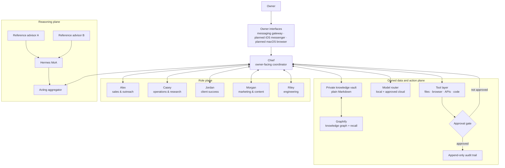
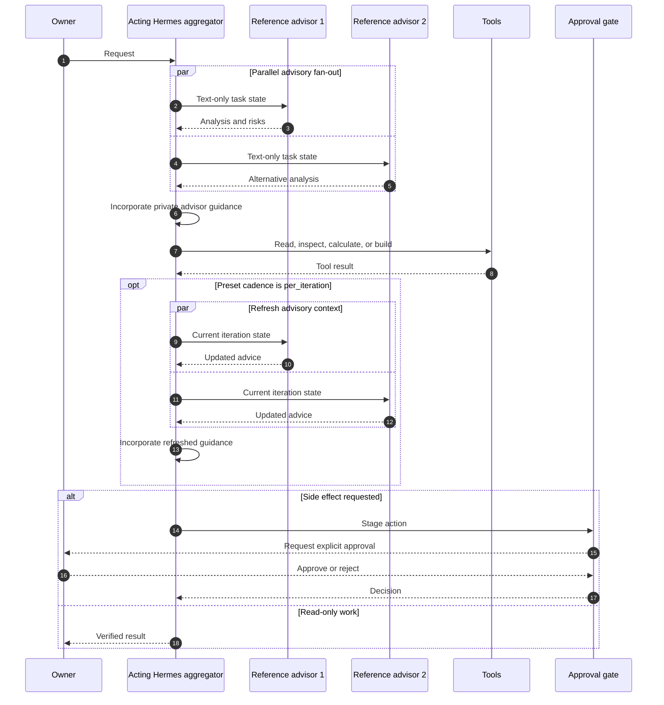
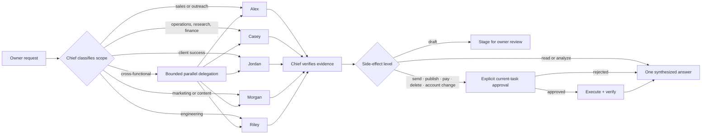
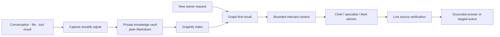
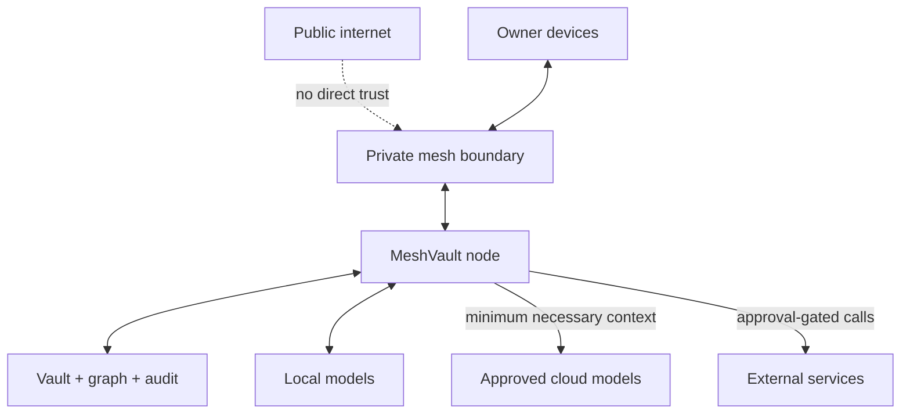

# MeshVault agentic architecture

A public reference for the mixture-of-agents and role-based orchestration patterns behind MeshVault.

> **Status:** architecture reference for a pre-release product. The MeshVault iOS secure agent messenger and macOS agentic browser are in design/build. This repository does not claim public availability.

## Why this exists

A useful agent system needs more than a large model. It needs several kinds of judgment, a single accountable operator, durable context, constrained tools, and explicit gates before real-world side effects.

MeshVault combines two orchestration layers:

1. **Mixture of Agents (MoA)** gives the acting agent diverse model advice before it decides what to do.
2. **Role orchestration** lets Chief delegate bounded work to five employee specialists and return one verified answer to the owner.

The layers complement each other. MoA improves reasoning. Role orchestration improves ownership, scope, and operational accountability.

## System view

## Hermes MoA loop

Hermes implements MoA as a virtual provider around the normal agent loop. Reference models are advisors: they receive a trimmed, text-only view of the current task state and cannot call tools. Their responses run in parallel, then the acting Hermes aggregator incorporates their private guidance and continues the normal agent and tool loop.

The aggregator is the sole acting model and retains Hermes’s normal tool loop. This separation matters: many models can advise, but only one agent owns the task and its side effects.

### Runtime properties

- Reference calls are independent and fan out concurrently, with a bounded worker pool.
- Advisors cannot use tools and do not act on the user's behalf.
- The aggregator is the acting model and retains Hermes's normal tool loop.
- If an advisor call fails, the failure is labeled in the aggregation context, successful advisor responses remain usable, and the turn continues with partial advice.
- Presets support `user_turn` cadence, which runs advisory fan-out once for each user turn, and `per_iteration` cadence, which runs advisory fan-out on each acting-agent loop iteration.
- Tool results shown to advisors are head-and-tail previews; the acting agent keeps the full transcript.
- Recursive MoA presets are rejected.
- Full MoA traces are opt-in, not automatic.
- Token usage and estimated cost are accounted for per advisor and aggregator model.

## Role orchestration

Chief is the sole owner-facing coordinator. The five employee agents are bounded workers, not independent public personas and not competing orchestrators.

### Specialist contract

| Role | Primary scope | Default boundary |
|---|---|---|
| Chief | Coordination, verification, owner communication | One accountable final answer |
| Alex | Sales and outreach | Draft or stage outbound work unless approved |
| Casey | Operations, research, finance | Evidence-first; money movement remains gated |
| Jordan | Client success | Customer context with outbound actions gated |
| Morgan | Marketing and content | Draft freely; publishing remains gated |
| Riley | Engineering | Build and verify; deployments and destructive changes remain gated |

Employee responses are treated as untrusted input until Chief verifies them against live state or primary sources.

## Context and memory

The vault is the durable source of knowledge. Graphify narrows retrieval before raw documents are opened. Live systems remain the source of truth for current account, service, deployment, and network state.

## Approval model

| Level | Example | Default behavior |
|---|---|---|
| L0 | Read, search, inspect, calculate | May run automatically |
| L1 | Draft, plan, summarize | May produce a staged artifact |
| L2 | Send, publish, deploy, change an account | Requires explicit current-task approval |
| L3 | Payment, destructive action, security/credential change | Requires deliberate approval and post-action verification |

The key rule is simple: delegation does not transfer authority. Every worker inherits the same action boundary as the coordinator.

## Trust boundaries

Design principles:

- Private mesh before public exposure.
- Local-first data and inference where practical.
- Minimum necessary context for cloud model calls.
- Explicit approval before external side effects.
- Append-only audit evidence for actions.
- One accountable coordinator even when many models or specialists contribute.

## What MoA is good for

MoA is useful when the cost of a shallow answer is higher than the cost of additional inference:

- architecture and security reviews
- ambiguous engineering decisions
- cross-functional plans
- adversarial critique before a high-impact action
- synthesis where models have meaningfully different strengths

It is a poor default for trivial lookups, deterministic calculations, or urgent low-risk tasks. More agents can add cost and correlated noise without adding insight.

## Current implementation notes

This public reference describes the intended and partially implemented system:

- Hermes MoA is a real runtime capability.
- Chief and five bounded employee roles are operational orchestration concepts used by MeshVault.
- MeshVault Vault, Graphify, tool routing, and approval gates are active implementation areas.
- The paired customer-facing iOS and macOS apps remain pre-release.
- Model names and providers are deployment choices, not architectural dependencies.

## Decision record

The architecture deliberately uses **one acting coordinator with advisory fan-out**, rather than several autonomous writers.

Why:

1. A single actor preserves a clear audit trail.
2. Advisory models can disagree without racing to mutate state.
3. Tool authority stays in one policy boundary.
4. Specialist work can be parallelized while final verification remains centralized.
5. Failure degrades to partial advice instead of conflicting side effects.

The trade-off is added latency and model cost. MeshVault therefore reserves MoA for decisions where diversity of judgment is worth paying for.

## Source basis

This reference is grounded in:

- Hermes MoA runtime behavior
- MeshVault’s Chief/employee role orchestration design
- the MeshVault owned-stack orchestration and approval model

No credentials, private paths, internal addresses, customer data, or proprietary implementation details are included.

## License

MIT. See [LICENSE](LICENSE).
